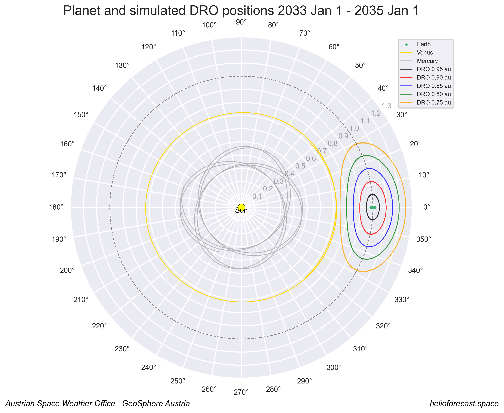

# dro_orbits

## Calculation of distant retrograde orbits for space weather forecast analyses

Author: C. Möstl, Austrian Space Weather Office, GeoSphere Austria

Last update: October 2025

work in progress!

---

### Scripts

**find_dro.ipynb**: finds optimized numerical solutions for dro orbits to provide initial conditions 

**dro.ipynb**: generates numerical solutions for dro orbits with given initial conditions, makes plots and animations for DRO analyses

---

### Dependencies
- environment *dro* is defined in /env/env_dro.yml, includes only standard packages
- needs ffmpeg for making movies https://www.ffmpeg.org
- file de442.bsp (114 MB) is automatically downloaded when running dro.ipynb for the first time from https://naif.jpl.nasa.gov/pub/naif/generic_kernels/spk/planets/ to folder *kernels/*
- spiceypy is used for generating the positions of the planets

---

### Papers

St. Cyr+ 2000: https://www.sciencedirect.com/science/article/abs/pii/S1364682600000699?via%3Dihub      
Frnka 2010: https://jan.ucc.nau.edu/~ns46/student/2010/Frnka_2010.pdf     
Perozzi+ 2017:  https://link.springer.com/article/10.1140/epjp/i2017-11644-0    
Lugaz+ 2024: https://agupubs.onlinelibrary.wiley.com/doi/10.1029/2024SW004189    
Cicalo+ 2025:  https://arxiv.org/abs/2508.02138  

---

### Installation

Create a conda environment using the "envs/env_dro.yml", and activate the environment:

    conda env create -f env_dro.yml

    conda activate dro

---

### Demo plot

