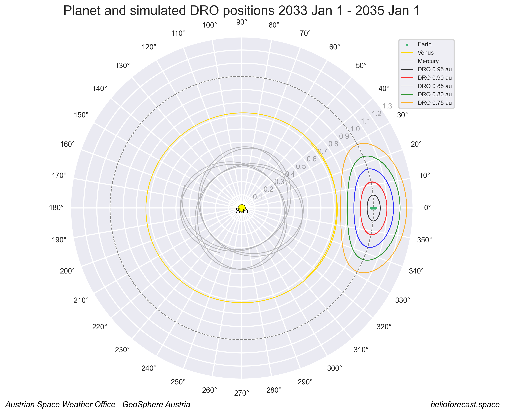

# dro_orbits
## Calculation of distant retrograde orbits for space weather forecast analyses

Author: C. Möstl, Austrian Space Weather Office, GeoSphere Austria

Last update: October 2025

---

### Scripts

dro.ipynb: generates numerical solutions for dro orbits and makes plots and animations

---

### Dependencies
- environment "dro" is defined in /env/env_dro.yml, includes only standard packages
- needs ffmpeg for making movies
- file de442.bsp (114 MB) is automatically downloaded from https://naif.jpl.nasa.gov/pub/naif/generic_kernels/spk/planets/ to folder kernels/ 

---

### Papers

Frnka 2010: https://jan.ucc.nau.edu/~ns46/student/2010/Frnka_2010.pdf

Perozzi+ 2017:  https://link.springer.com/article/10.1140/epjp/i2017-11644-0

Cicalo+ 2025:  https://arxiv.org/abs/2508.02138

---

### Installation

Create a conda environment using the "envs/env_dro.yml", and activate the environment:

    conda env create -f env_dro.yml

    conda activate dro

---

### Demo plot

